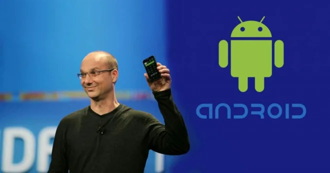
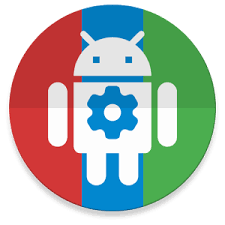

## 1. Andy Rubin

He because he is the main founder of Android. Which Google bought $50 Million dollars. I’ve added him because without him, Android couldn’t have been existed, there will be no modders and developers like me creating Android forks.

## 2. Bill Gates

Bill Gates co – founded with Paul Allen. They founded Microsoft which made Windows. FYI, Windows is the most dominant in computer operating system for PC followed by Apple Mac OS then Linux. At first Windows was just color based but now, it was the best Windows 10 ever, combined the Live Tile (Windows 8) and the revival of Start Menu style. (Windows 7)

## 3. Chainfire

I think that is not his real name. Consider him as the founder of modding in Android. Back in Android as early as Cupcake 1.5. He is able to crack Android code, and able to install root access. Since then many modders followed what Chainfire started. Still, this time, he is working on FlashFire(On device flashing app) and in root fix in Google Pixel. Lately he developed systemless root for Android 6.0 following Touchwiz 5.1.1. Then Nougat.

## 4. Rocky Gathercole

He was just a simple girlish boy. Back then he didn’t actually think to be a designer but later on in his life, a filipino designer meet up with him and he suggested to Rocky to became as a designer. His life wasn’t a glorious in the start but slowly he became famous and started to design some hollywood artists their gown or suite. Perfect example of “Some People Achieve Greatness”.

## 5. Steve Jobs

Believe it or not, i do not actually idolize Apple at first. But now im amazed what Apple has done in making iOS buttery smooth. It’s Steve Jobs who is the father of where is Apple right now. But sadly he is dead already.

## 6. Hershey Hilado

Her life wasn’t very easy. She is not born with golden spoon on her mouth. Her parents were not easy on her, here parents forcefully married her to a Korean man in exchange for money. But managed to escape to Manila and eventually found by his father relatives, there via laptop of her aunt, she met an Australian man, and the man fetched Hershey from Philippines. 

She thought that her life is going to perfect this time but not. And eventually broke up with his fiance and she build her own business but it got roughs so she switched to an online store. There, she eventually she got famous after a celebrity noticed her clothes she sells.

## 7. President Rodrigo Roa Duterte

Well after many years of waiting. There he comes, our new great president. Even i didn’t remember what all he had promised, i feel that everything is slowly but surely going up specially in our economy, add to that, i feel much safer now because of his campaign against illegal drugs.

## 8. John Wu

The creator of the most popular Magisk. The universal systemless interface. I can’t find his picture though.

<cite>Magisk is a tool in Android devices that is used to root a device systemlessly, it doesn’t modify any system files thus bypassing SafetyNet which is developed by Google.</cite>

Thanks to several contributors to android. John Wu came up with this tool. Lives in Taiwan. He is very friendly, (But almost developers and modders from XDA do) actually he provided a help (full documentation) to those who want to work this mod with their device.

## 9. Pent

Who created the most powerful automation app on android. Still, this day, I can’t get his pic.

<cite>Tasker is in which you can create profiles that can automate several things like moving files at a certain time or answer a phone call when you are in home. But it’s pretty complicated specially for begginers as mostly it depends on global variables.</cite>

He is friendly just like John Wu, and even for begginers, he advises them what to do and how to do it in Tasker.

## 10. Jamie

He created MacroDroid, an automation app but much easier to understand for begginers.

<cite>MacroDroid provides a simple user interface, you got set: trigger, an action and an optional constraint, compare to complicated UI of Tasker</cite>

Just like the first two, he is also friendly. He responds to those who post andasking for help in our forum for that app. He also takes feature request. And guess what, he is an Indi Developer which means,he is the only one who’s working on MacroDroid.